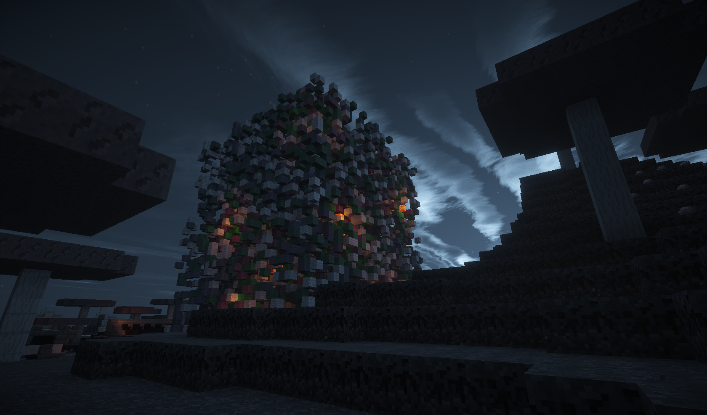

# DeathCube

This is a plugin for Spigot servers allowing you to play a mini game, called "DeathCube". The player must climb up a
randomly generated cube with air in it. The one, who reaches the top first, wins. At the same time, the cube begins to
burn from the bottom.

The plugin was originally developed by [baba43](https://github.com/baba43). This is a decompiled version of the original
plugin from 2016 which is made compatible with the newest Spigot version.



## Usage

### Create a DeathCube

To create a cube you need to select your new cube first. If the selected cube does not exist, the plugin will the tell
you that you should set the first position to create it.

```
/dc select <name>
```

Now you need to select the location for the cube area. Mark the edges with the following commands:

```
/dc pos 1
/dc pos 2
```

Now you would be able to create the cube, but you need to set a spawn before players can use it. Find a cool place and
type:

```
/dc spawn
```

Finally to create the cage type in:

```
/dc create
```

### Start a game

First you need to teleport into a DeathCube:

```
/dc tp [name]
```

Once everybody is ready start the countdown with:

```
/dc start [minutes]
```

### Customize the DeathCube

If you want to change the appearance of your DeathCube first spawn a block bar:

```
/dc bar
```

You change the blocks of your cube by changing the blocks in your block bar. The upper row represents the cube, the
lower one the cage. The glass block marks the origin and is not important. On top of the glass you can define the floor
of the stage where players are spawning in. After changing the block bar you need to run `/dc bar reload` to let the
plugin reload the blocks. It will stop reading blocks when it detects any air block or it reached 20 blocks. The block
bar is protected from break / place events by non-moderators.

### Commands

#### Setup

| Command              | Description                                                        |
|----------------------|--------------------------------------------------------------------|
| `/dc select <name>`  | If the selected cube does not exist a new cube will be created     |
| `/dc pos 1`          | Marks your current position as the first corner                    |
| `/dc pos 2`          | Marks your current position as the second corner                   |
| `/dc spawn`          | Saves you current position and looking direction as spawn position |
| `/dc create`         | Prepares the area for the selected cube                            |
| `/dc bar`            | Creates the block bar at your position                             |
| `/dc default <name>` | Marks a cube as the DeathCube                                      |
| `/dc delete <name>`  | Removes an existing DeathCube                                      |

#### Administration

| Command                 | Description                                                   |
|-------------------------|---------------------------------------------------------------|
| `/dc bar reload`        | Reloads the block bar to update the blocks                    |
| `/dc new`               | Renews the cube and the stage                                 |
| `/dc start [minutes]`   | Starts a game in X minutes or 15 seconds if left empty        |
| `/dc stop`              | Stops the current game                                        |
| `/dc set <key> <value>` | Set the value of `<key>` to `<value>` (in-game configuration) |
| `/dc get <key>`         | Returns the current value for the specific key                |
| `/dc open`              | Opens the gates to allow users to play offline                |
| `/dc clear`             | Removes cube from startHeight to 255                          |

#### Playing

| Command             | Description                                                    |
|---------------------|----------------------------------------------------------------|
| `/dc select <name>` | Selects a cube if existing                                     |
| `/dc list`          | Prints a list of all available DeathCubes                      |
| `/dc timer`         | Displays the active countdowns for the selected cube           |
| `/dc tp [name]`     | Teleports the sender into the cube                             |
| `/dc tpi [name]`    | Teleports the sender into the cube ignoring an empty inventory |
| `/dc leave`         | Leave the cube area or a running game                          |
| `/dc food`          | Satisfies the hunger                                           |

#### Special

| Command    | Description                          |
|------------|--------------------------------------|
| `/dc info` | Displays your current plugin version |
| `/dc help` | Displays a little help page          |

### Permissions

| Permission        | Description                                                  |
|-------------------|--------------------------------------------------------------|
| `deathcube.use`   | Play DeathCube                                               |
| `deathcube.admin` | Create a new cube or change its location                     |
| `deathcube.mod`   | Manage games or change the config (except from the location) |
| `deathcube.start` | Start games in public mode                                   |